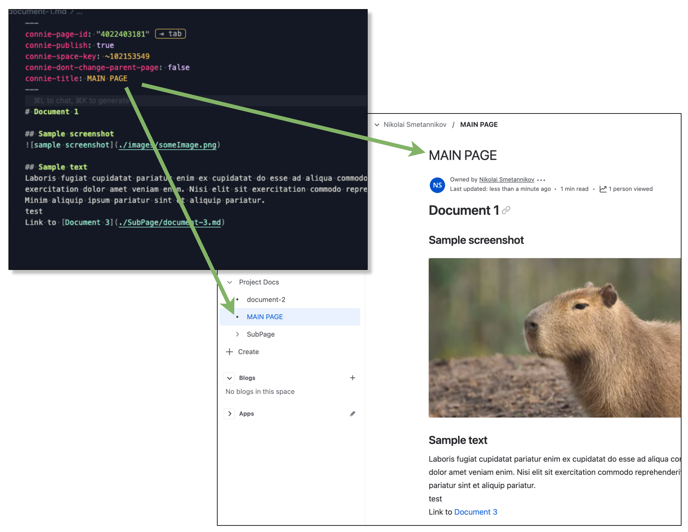

# Markdown to Confluence (MTC)

A simple CLI tool to publish markdown files to Confluence with a single command while maintaining proper internal references and structure. This project is based on a minor fork of [markdown-confluence](https://github.com/markdown-confluence/markdown-confluence) to remove heavy image compression and add custom styling for mermaid diagrams with some additional logic to translate local md references to correct Confluence page links.


## Features

- Automatically publishes markdown files to Confluence from any folder with MD files/folders with a single command.
- Maintains folder structure and internal references
- Correctly inserts images 
- Custom styling for mermaid diagrams' rendering

## Prerequisites

- [Node.js](https://nodejs.org/)
- Git

## Installation

```bash
git clone https://github.com/NickSmet/markdown-to-confluence
cd markdown-to-confluence
npm install
npm link
```

## Usage

```bash
# In your docs directory
mtc

# Or specify a different directory
mtc -d path/to/docs
```

On first run, you'll be prompted for required configuration values. These can be provided via:

1. Local `.markdown-confluence.json` in your docs directory
2. Environment variables in your `.zshrc` or `.bashrc`

### Updating pages

To push changes after having edited/added pages, simply run the command again. 

Note that to track relations between md files and pages, the tool adds frontmatter to the md files with 'connie-page-id' being the most important one.

Initially, pages are created with title being the name of the md file. But you can change this by updating the 'connie-title' field in the frontmatter.


#### Example Frontmatter
```yaml
---
connie-title: "My Custom Page Title"
connie-publish: true
connie-page-id: "123456"
connie-dont-change-parent-page: true
---

# Your page content here
```

You can add the fields before initial publish. E.g. set 'connie-publish' to 'false' to prevent publishing. Another useful one is 'connie-dont-change-parent-page' to prevent the tool from changing the page's parent. This way you can manually move the page to some other place and not worry about it being reverted when republishing.

#### Connie Parameters Reference
```
## connie-publish
- Type: boolean
- Default: false
- Description: Controls whether the page should be published to Confluence

## connie-title
- Type: string
- Default: ""
- Description: Specifies the title of the Confluence page. If not set and firstHeadingPageTitle setting is enabled, will use the first heading from the content.

## connie-page-id
- Type: string (numbers only)
- Default: undefined
- Description: The Confluence page ID where the content should be published. Must contain only numbers.

## connie-dont-change-parent-page
- Type: boolean
- Default: false
- Description: Controls whether the parent page relationship should be preserved. When true, the page's parent in Confluence won't be changed during updates.

## connie-blog-post-date
- Type: string
- Default: undefined
- Format: "YYYY-MM-DD"
- Description: Specifies the publication date for blog posts.

## connie-content-type
- Type: string
- Default: "page"
- Values: "page" | "blogpost"
- Description: Specifies the type of content to create in Confluence. Automatically set to "blogpost" if connie-blog-post-date is specified.
```

## Configuration

You can configure the tool using a combination of a local `.markdown-confluence.json` file and environment variables. While environment variables are recommended for credentials, all settings can be configured either way.

### Environment Variables (Recommended for Credentials)
```bash
# Required - User-specific credentials (recommended approach)
export ATLASSIAN_USER_NAME="your.email@company.com"
export CONFLUENCE_API_TOKEN="YOUR_API_TOKEN"

# Optional - Can override project settings
export CONFLUENCE_BASE_URL="https://your-org.atlassian.net"
export CONFLUENCE_SPACE_KEY="YOUR_SPACE"
export CONFLUENCE_PARENT_ID="123456"

# Alternative prefixes available:
# CONNIE_USER, CONNIE_API_TOKEN, CONNIE_BASE_URL, CONNIE_SPACE, CONNIE_PARENT
```

### Project Configuration File (`.markdown-confluence.json`)
This file should be committed to version control and contain project-specific settings. Credentials can also be stored here, though environment variables are recommended for security:

```json
{
  // Required settings (can be provided via env vars instead)
  "confluenceBaseUrl": "https://yourcompany.atlassian.net",
  "confluenceSpaceKey": "YOUR_SPACE_KEY",
  "confluenceParentId": "YOUR_PARENT_ID",
  "atlassianUserName": "user@example.com",     // Recommended to use env var instead
  "atlassianApiToken": "YOUR_API_TOKEN",       // Recommended to use env var instead
  
  // Optional settings
  "folderToPublish": ".",
  "contentRoot": ".",
  "ignore": ["images", "assets/images"],
  "mermaid": {
    "theme": "base",
    "padding": 5,
    "themeVariables": {
      "background": "#181010",
      "primaryColor": "#ddebff"
    }
  }
}
```

### Configuration Best Practices

1. **Environment Variables** (in `.zshrc` or `.bashrc`)
   - Credentials and secrets (API tokens) - **Strongly recommended**
   - User-specific settings (username) - **Recommended**
   - Can optionally override project settings

2. **Project Configuration** (in `.markdown-confluence.json`)
   - Team-wide settings (base URL, space key)
   - Project structure (folders, ignore patterns)
   - Visual configuration (mermaid settings)
   - Should be version controlled
   - Can contain credentials (not recommended)

3. **Security Considerations**
   - Never commit API tokens or sensitive data to version control
   - Use environment variables for secrets (recommended)
   - If storing credentials in `.markdown-confluence.json`:
     - Add it to `.gitignore`
     - Ensure file permissions are restricted
     - Consider using environment variables instead

### Configuration Precedence
1. Environment variables (highest priority)
2. `.markdown-confluence.json` settings (fallback)
3. Default values (lowest priority)

### Required Settings
These can be provided either via environment variables (recommended for credentials) or in the config file:
- `atlassianUserName` - Your Atlassian account email
- `atlassianApiToken` - Your Atlassian API token
- `confluenceBaseUrl` - Your Confluence instance URL
- `confluenceSpaceKey` - Key of the Confluence space
- `confluenceParentId` - ID of the parent page

### Optional Settings
These are typically set in the config file:
- `folderToPublish` - Source folder with markdown files (default: ".")
- `contentRoot` - Root folder for content (default: same as folderToPublish)
- `ignore` - Patterns for files/folders to ignore
- `mermaid` - Mermaid diagram configuration

See [Mermaid documentation](https://mermaid.js.org/config/theming.html) for diagram configuration options.

### Image Handling

Images are supported via relative paths and automatically uploaded to Confluence. The following directories are excluded from page creation but can store images:
- `images/`
- `assets/images/`

Example structure:
```
your-docs/
├── images/           # Local images
├── assets/
│   └── images/      # Alternative image location
└── docs/
    └── example.md   # Reference images using relative paths
```

Usage in markdown:
```markdown


```
